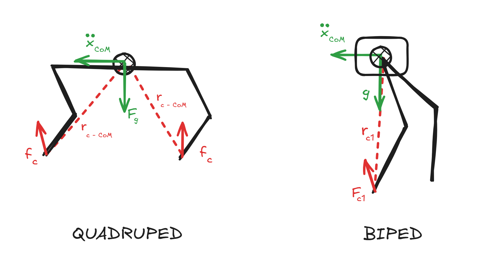
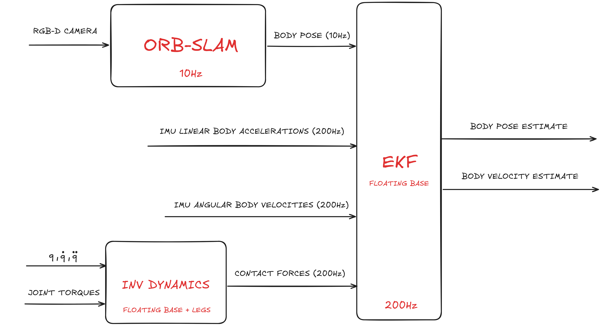

# EKF for Humanoid Robots

<div>
    
</div><br>

In this project, we implement **state estimation** for a biped humanoid robot using an **Extended Kalman Filter (EKF)**. The goal is to locally estimate the robot’s base pose and velocities using only onboard sensors.

## Problem

Estimate the state of the robot (position, orientation, linear and angular velocity) using the following available sensors:

- 1 RealSense RGB-D camera  
- IMU (angular velocities, linear accelerations)  
- Joint encoders and torque sensors (joint positions, velocities and torques)

## EKF

<div>
    
</div><br>

To estimate the robot's state we use an Extended Kalman Filter (EKF) with a floating rigid body dynamic model. The state vector $\mathbf{x}$ represents the position, velocity, orientation and angular velocity of the center of mass (CoM), while the control input vector $\mathbf{u}$ consists of external contact forces applied to the body.

### State Vector

$$
\mathbf{x} = 
\begin{bmatrix}
\mathbf{p} \\
\boldsymbol{\theta} \\
\mathbf{v} \\
\boldsymbol{\omega}
\end{bmatrix}
\in \mathbb{R}^{12}
$$

Where:

- $\mathbf{p}$: position of the base (world frame)  
- $\boldsymbol{\theta}$: orientation (roll, pitch, yaw)  
- $\mathbf{v}$: linear velocity (world frame)  
- $\boldsymbol{\omega}$: angular velocity (body frame)

### Input Vector

The control input consists of foot **contact forces**:

```math
\mathbf{u} = 
\begin{bmatrix}
\mathbf{F}_{c1} \\
\boldsymbol{F}_{c2} \\
\end{bmatrix}
\in \mathbb{R}^{6}
```

Where:

- $\mathbf{F}_{c1}$: Contact force associated to left foot (world frame)  
- $\mathbf{F}_{c2}$: Contact force associated to right foot (world frame)  

**Note**: We will need to estimate these contact forces, since we do not have force sensors on the feet.

### Dynamic Equations (Floating Base Rigid Body)

In this model, we treat the robot as a single rigid body with mass concentrated at the center of mass (CoM). This is a common and effective simplification when dealing with floating base dynamics, especially for state estimation purposes.

The system dynamics are divided into two main components:

- **Translational dynamics**: describe how the position and linear velocity of the CoM evolve under external forces.
- **Rotational dynamics**: describe how the orientation and angular velocity of the body evolve under external torques induced by contact forces.

These equations form the basis for predicting the robot's motion given contact forces, gravity and inertial effects.

**Translational Dynamics:**

$$
m \ddot{\mathbf{p}} = \sum \mathbf{F}_c^i + m \mathbf{g}
$$

Where:
- $m$: mass of the robot
- $\ddot{\mathbf{p}}$: acceleration of the CoM in the world frame
- $\mathbf{F}_c$: net external contact force (in world frame)
- $m \mathbf{g}$: gravitational force acting on the CoM

**Rotational Dynamics:**

$$
\mathbf{I} \dot{\boldsymbol{\omega}} + \boldsymbol{\omega} \times \mathbf{I} \boldsymbol{\omega} = \sum (\boldsymbol{r}_c^i \ \times \ \boldsymbol{F}_c^i)
$$

Where:
- $\mathbf{I}$: inertia matrix of the rigid body
- $\dot{\boldsymbol{\omega}}$: angular acceleration in the body frame
- $\boldsymbol{\omega}$: angular velocity in the body frame
- $\boldsymbol{F}_c$: contact force
- $\boldsymbol{r}_c$: distance between contact point and CoM

### State Space Form

We now write the system dynamics in the form:

$$
\dot{\mathbf{x}} = \mathbf{f}(\mathbf{x}, \mathbf{u})
$$

The state $\mathbf{x} \in \mathbb{R}^{12}$ evolves according to the floating base rigid body dynamics, and the input $\mathbf{u} \in \mathbb{R}^6$ consists of external foot contact forces. To make the model tractable for real-time estimation, we make the following assumptions:

**Note 1: Simplifications**

We assume:

- The inertia tensor $\mathbf{I}$ is constant and diagonal (mass symmetrically distributed).
- Roll and pitch angular velocities are small.

Therefore:

$$
\frac{d}{dt}(\mathbf{I} \boldsymbol{\omega}) = \mathbf{I} \dot{\boldsymbol{\omega}} + \boldsymbol{\omega} \times \mathbf{I} \boldsymbol{\omega} \approx \mathbf{I} \dot{\boldsymbol{\omega}}
$$

**Note 2: Orientation–Angular Velocity Mapping**

We represent orientation using ZYX Euler angles: $\boldsymbol{\theta} = [\phi, \theta, \psi]^T$

To relate body angular velocity $\boldsymbol{\omega}$ to the time derivative of Euler angles $\dot{\boldsymbol{\theta}}$, we use the transformation:

$$
\boldsymbol{\omega} = T(\boldsymbol{\theta}) \dot{\boldsymbol{\theta}}
$$

Where the matrix $T(\boldsymbol{\theta}) \in \mathbb{R}^{3 \times 3}$ for ZYX convention is:

$$
T(\boldsymbol{\theta}) =
\begin{bmatrix}
1 & 0 & -\sin\theta \\
0 & \cos\phi & \cos\theta \sin\phi \\
0 & -\sin\phi & \cos\theta \cos\phi
\end{bmatrix}
$$

When roll and pitch are small, $T(\boldsymbol{\theta}) \approx I_{3 \times 3}$, which simplifies the model further. However, we will retain the full nonlinear form.

**Simplified State Space Form**:

```math
\dot{\mathbf{p}} = \mathbf{v}
```

```math
\dot{\boldsymbol{\theta}} = T^{-1}(\boldsymbol{\theta}) \boldsymbol{\omega}
```

```math
\dot{\mathbf{v}} = \frac{1}{m} \left( \mathbf{F}_{c1} + \mathbf{F}_{c2} \right) + \mathbf{g}
```

```math
\dot{\boldsymbol{\omega}} = \mathbf{I}^{-1} \left( \mathbf{r}_{c1} \times (\mathbf{R}_{\text{world}}^{\text{body}} \cdot \mathbf{F}_{c1}) + \mathbf{r}_{c2} \times (\mathbf{R}_{\text{world}}^{\text{body}} \cdot \mathbf{F}_{c2}) \right)
```

Where:
- $\mathbf{p}$ is the position of the base in world frame
- $\boldsymbol{\theta}$ is the orientation (roll, pitch, yaw)
- $\mathbf{v}$ is the linear velocity (world frame)
- $\boldsymbol{\omega}$ is the angular velocity (body frame)
- $\mathbf{F}_c^i$ is the $i$-th foot contact force (expressed in world frame)
- $\mathbf{R}_{\text{world}}^{\text{body}}$: rotation matrix between body frame and world frame.
- $\mathbf{r}_i$ is the moment arm from CoM to the $i$-th foot contact point (body frame)
- $\mathbf{g}$ is gravity (in world frame)

### Linearized A,B Matrices

To apply the Extended Kalman Filter (EKF), we linearize the nonlinear dynamics around the current state estimate. This results in a linear system of the form:

$$
\dot{\mathbf{x}} = A \mathbf{x} + B \mathbf{u}
$$

Where:
- $\mathbf{x} \in \mathbb{R}^{12}$ is the state vector
- $\mathbf{u} \in \mathbb{R}^6$ is the input (external foot contact forces)

#### A Matrix – State Jacobian

The matrix $A = \frac{\partial f}{\partial \mathbf{x}}$ captures how the state evolves based on the current state. It includes the following blocks:

$$
A = 
\begin{bmatrix}
0 & 0 & I_3 & 0 \\
0 & \frac{\partial f_2}{\partial \boldsymbol{\theta}} & 0 & T^{-1}(\boldsymbol{\theta}) \\
0 & 0 & 0 & 0 \\
0 & \frac{\partial f_4}{\partial \boldsymbol{\theta}} & 0 & 0 \\
\end{bmatrix}
$$

Where:
- $I_3$: 3×3 identity matrix
- $T^{-1}(\boldsymbol{\theta})$: transformation matrix relating Euler angle rates to angular velocity

#### B Matrix – Input Jacobian

The matrix $B = \frac{\partial f}{\partial \mathbf{u}}$ maps input contact forces to the state derivatives:

```math
B =
\begin{bmatrix}
0 & 0 \\
0 & 0 \\
\frac{1}{m} I_3 & \frac{1}{m} I_3 \\
I^{-1} \cdot \text{skew}(\mathbf{r}_{c1}) \cdot R(\boldsymbol{\theta}) & I^{-1} \cdot \text{skew}(\mathbf{r}_{c2}) \cdot R(\boldsymbol{\theta}) \\
\end{bmatrix}
```

Where:
- $\text{skew}(\mathbf{r}_i)$: skew-symmetric matrix for cross product with moment arm $\mathbf{r}_i$
- $R(\boldsymbol{\theta})$: rotation matrix from world frame to body frame

**Note**

Matrices $A$ and $B$ must be updated at each time step since they depend on the current orientation $\boldsymbol{\theta}$, through $T$ and $R$, and on $\mathbf{r}_i$ (i.e. moment arm from CoM to the $i$-th foot contact point).

### Measurements

In order to use EKF, I need to rely on some measurements which will correct my update based only on blind dynamic equations. ORB-SLAM gives me $\mathbf{\hat{p}}_{\text{com}}, \mathbf{\hat{\phi}}$ (e.g. position and orientation estimates of the robot), while IMU gives me $\hat{\ddot{\mathbf{p}}}_{\text{com}} , \hat{\omega}$ (e.g. linear accelerations and angular velocities). I will add these values to the measurements vector $z$.

```math
\mathbf{z} = \begin{bmatrix} 
\mathbf{\hat{p}}_{\text{SLAM}} \\
\mathbf{\hat{\phi}}_{\text{SLAM}} \\
\hat{\mathbf{a}}_{\text{IMU}} \\
\boldsymbol{\hat{\omega}}_{\text{IMU}}
\end{bmatrix}
```

### Scheme

<div>
    
</div><br>

The EKF fuses data from three sensors: angular velocity $\omega$ from the IMU (200 Hz), linear acceleration from the IMU (200 Hz) and pose estimates (position, orientation) from the camera (10 Hz). Since ORB-SLAM operates at lower frequency, we shall use an asynchronous fusion scheme: the prediction step runs at 200 Hz using IMU measurements and the update step is called at the same 200 Hz rate. When no new camera measurement is available, the update uses only IMU observations, while when a new camera pose arrives, the corresponding observation model is included in the update step.

## Contact Forces Estimation

To estimate contact forces at the feet, we use the full-body dynamics equation of a humanoid robot, which includes both the floating base and the leg joints:

$$
M(q) \ddot{q} + h(q, \dot{q}) = S^\top \tau + J_c^\top F_c
$$

Where:

- $q$: generalized coordinates (floating base + joint positions)  
- $M(q) \in \mathbb{R}^{n \times n}$: inertia (mass) matrix  
- $h(q, \dot{q})$: Coriolis, centrifugal, and gravitational effects  
- $\tau \in \mathbb{R}^{m}$: joint torques (measured from sensors)  
- $S \in \mathbb{R}^{m \times n}$: selection matrix for actuated joints  
- $J_c \in \mathbb{R}^{3 \times n}$: contact Jacobian for all feet in contact  
- $F_c \in \mathbb{R}^{3}$: contact forces at the feet (output to estimate)

### Inverse Dynamics for Contact Force Estimation

Since $\tau, q, \dot{q}, \ddot{q}$ are measured or estimated, we can solve for the unknown contact forces $F_c$:

$$
F_c = (J_c^\top)^\dagger \left( M(q) \ddot{q} + h(q, \dot{q}) - S^\top \tau \right)
$$

- $(J_c^\top)^\dagger$: pseudoinverse of the transposed contact Jacobian.  

This gives us the contact wrench (forces and torques) applied at the feet. These estimated contact forces are then used as control inputs to the Extended Kalman Filter (EKF) for improved state estimation of the floating base.

## Key Works and Citations

- **F. Stark, J. Middelberg (2025)**: [*QP Formulations and Solvers for Dynamic Quadrupedal Walking*](https://arxiv.org/pdf/2502.01329)
- **G. Raiola, E. Mingo (2023)**: [*A simple yet effective whole-body locomotion framework for quadruped robots*](https://hal.science/hal-03005133v2/file/Frontiers20_QuadrupedalWalking.pdf)
- **J. Li, J. Ma (2023)**: [Dynamic Loco-manipulation on HECTOR: Humanoid for Enhanced ConTrol and Open-source Research*](https://arxiv.org/pdf/2312.11868)
- **D. Kim, J. Di Carlo (2019)**: [*Highly Dynamic Quadruped Locomotion via Whole-Body Control and Model Predictive Control*](https://arxiv.org/pdf/1909.06586)
